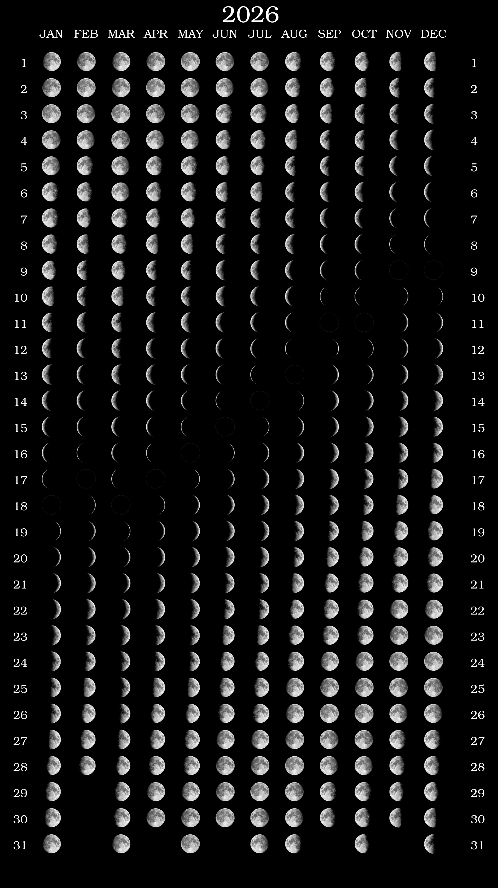

# Moon Phases Calendar

Generate printable SVG calendars showing moon phases for any year using only Python standard library.

Example



## Installation

```bash
pip install -e .
```

## Usage

### 1. Download moon phase images

```bash
moonphases download -o images
```

This downloads 15 moon phase images (new moon to full moon) from astro-seek.com.

### 2. Generate calendar SVG

```bash
moonphases generate 2027 -i moonphases -o moon_calendar_2027.svg
```

Options:
- `-i, --images`: Directory containing moon phase images (default: `images`)
- `-o, --output`: Output SVG file (default: `moon_calendar_YEAR.svg`)
- `--img-size`: Size of moon images in pixels (default: 30)
- `-t, --theme`: Theme name (`white`, `yellow`; default: `white`)
- `--lat, --latitude`: Observer latitude in degrees for moon tilt

### Themes

The calendar supports multiple themes with different moon images:

| Theme | Images | Description |
|-------|--------|-------------|
| `white` | `d_150_*.jpg`, `u_150_*.jpg` | White moon on black, separate waxing/waning images |
| `yellow` | `*.png` | Yellow/gold moon, waxing images mirrored for waning |

Theme images are located in `moonphases/theme_<name>/` directories.

```bash
# Generate with yellow theme
moonphases generate 2027 -i moonphases -t yellow
```

### Moon Tilt

The `--lat` option rotates moon images based on the observer's latitude to show the moon's parallactic angle - how the terminator line appears tilted in the sky:

```bash
# Calendar for 45°N (e.g., northern Italy, Oregon)
moonphases generate 2027 -i moonphases --lat 45

# Calendar for southern hemisphere (e.g., Sydney at 34°S)
moonphases generate 2027 -i moonphases --lat -34
```

## Project Structure

```
moonphases/
├── src/moonphases/
│   ├── __init__.py
│   ├── __main__.py    # CLI entry point
│   ├── calendar.py    # SVG generation
│   ├── downloader.py  # Image downloading
│   └── themes.py      # Theme configuration
├── moonphases/        # Moon phase images
│   ├── theme_white/   # White moon theme (jpg)
│   └── theme_yellow/  # Yellow moon theme (png)
├── images/            # Generated outputs
├── pyproject.toml
└── README.md
```

## How it works

The calendar calculates moon phases using the synodic month (29.53 days) from a reference new moon date. Each day is mapped to a moon phase image index.

Themes can provide separate waxing (new→full) and waning (full→new) images, or waxing images can be horizontally mirrored for waning phases.

When latitude is provided, the moon tilt angle is calculated based on the moon's declination and observer position, giving a realistic representation of the moon's orientation in the sky.
